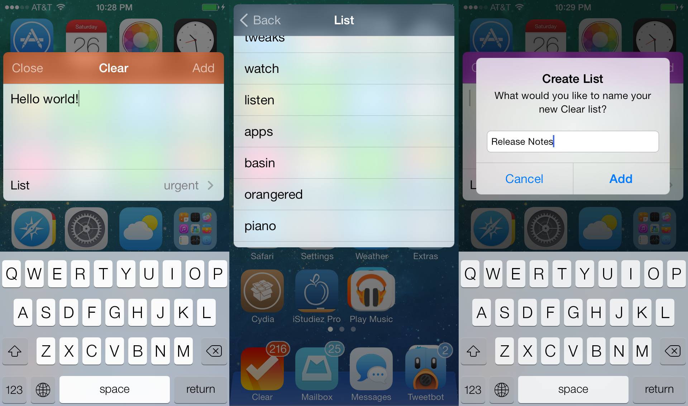

Clear For ProWidgets
=======================

Use Clear on the fly from [ProWidgets](http://prowidgets.net/). Advanced widget implementation using the [ProWidgets API](http://prowidgets.net/doc/), live preferences (plist) and database (sqlite3) reading, and instantaneous background task adding ([OBJCIPC](https://github.com/a1anyip/libobjcipc)), providing a beautiful, seamless Clear experience. Available from [BigBoss](http://thebigboss.org) for free.

---------------------------------------
[Creative Commons Attribution-NonCommercial 3.0 United States License](http://creativecommons.org/licenses/by-nc/3.0/us/) as of 2014:

	Creative Commons Attribution-NonCommercial 3.0 United States License
	Please visit above link for full license.
	Human-readable summary of your abilities has been transcribed below.

	You are free to:
	Share — copy and redistribute the material in any medium or format
	Adapt — remix, transform, and build upon the material
	The licensor cannot revoke these freedoms as long as you follow the license terms.

	Under the following terms:
	Attribution — You must give appropriate credit, provide a link to the license, and indicate if changes were made. You may do so in any reasonable manner, but not in any way that suggests the licensor endorses you or your use.
	NonCommercial — You may not use the material for commercial purposes.
	No additional restrictions — You may not apply legal terms or technological measures that legally restrict others from doing anything the license permits.

	Notices:
	You do not have to comply with the license for elements of the material in the public domain or where your use is permitted by an applicable exception or limitation.
	No warranties are given. The license may not give you all of the permissions necessary for your intended use. For example, other rights such as publicity, privacy, or moral rights may limit how you use the material.
